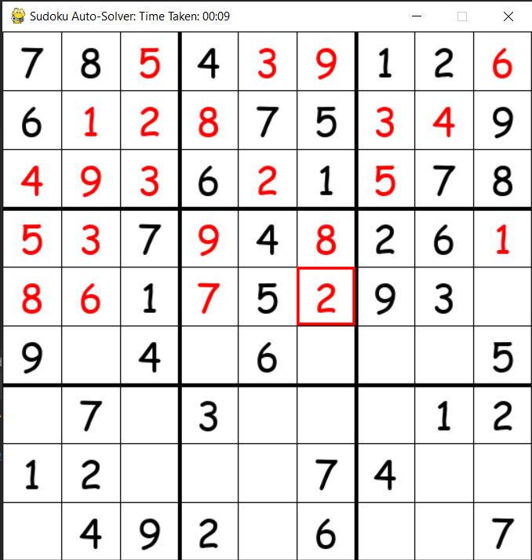
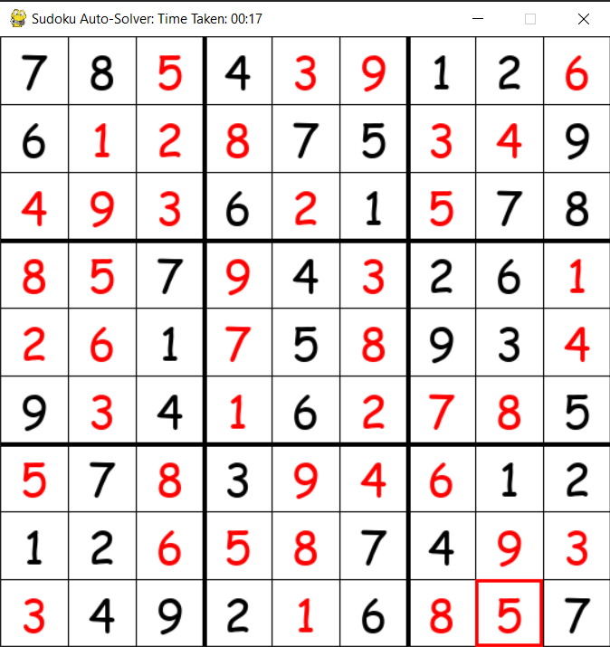

# Sudoku Backtracking Solver

In this project, I created a backtracking algorithm to solve a Sudoku puzzle. The progress of the algorithm is displayed on the screen to the user in a window created using Pygame. 

This project was to get help me understand how to use Pygame to show what an algorithm is doing. The skill I have learnt here will be used in a algorithm visualiser created in Python:

[Algorithm Visualiser can be found here](https://github.com/LP2851/Sudoku-Backtracking-Solver)

### Here is the visualiser when solving the Sudoku puzzle:

### Here is the visualiser when the Sudoku puzzle is solved:
